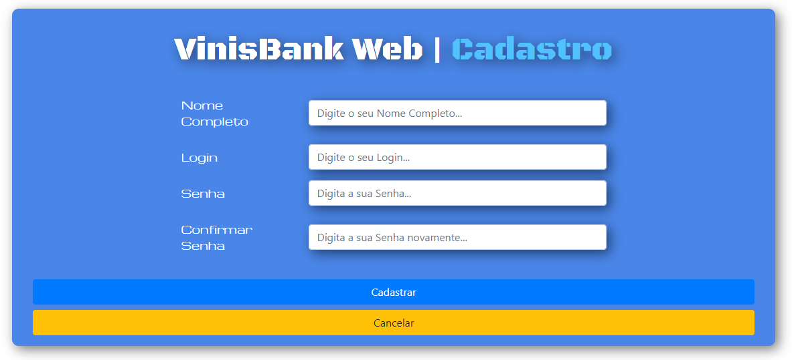
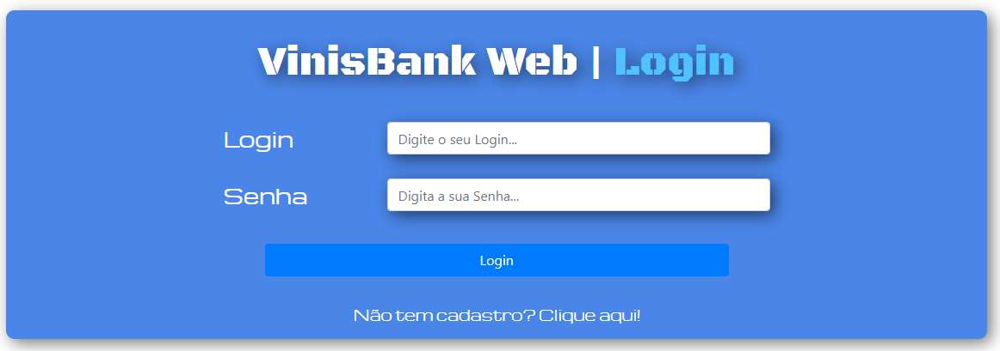
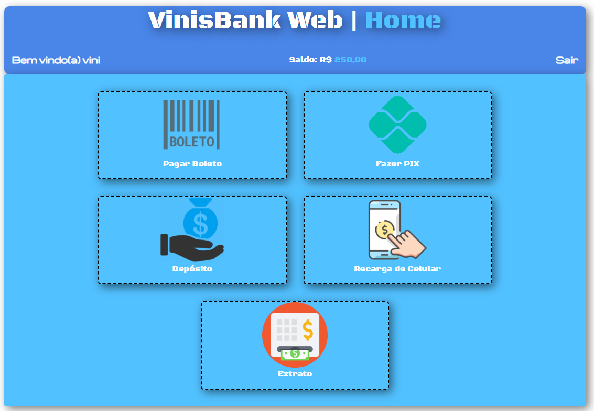

<h1 align="center">VinisBank - Web</h1>
<h4 align="center">Aplicação de um banco Digital que realiza algumas operações bancárias, como PIX, Depósitos, Pagamento de Boletos, Recarga de Celular e Extrato.</h4> &#xa0;

**<p align="center">Sumário</p>**
<p align="center">
<a href="#dart-sobre">Sobre</a> &#xa0; | &#xa0;
<a href="#computer-tecnologias">Tecnologias</a> |
<a href="#books-O-que-eu-aprendi">O que aprendi</a> &#xa0; 
</p>
<p align="center">
<a href="#hammer_and_wrench-serviços">Serviços</a> &#xa0; | &#xa0;
<a href="#scroll-rodando-o-projeto">Rodando o projeto</a> &#xa0; | &#xa0;
<a href="#sparkles-autor">Autor</a>
</p>

 &#xa0;
 
## :dart: Sobre
<p>O principal objetivo do projeto foi solidificar mais o conceito de posicionamento dos elementos da página.</p>
<p>Começar a trabalhar com dados do SessionStorage</p>
<p>E também consolidar o conhecimento do Framework Bootstrap para a estilização e responsividade.</p>

### Deploy: https://viniciuslemos93.github.io/VinisBank-Web/

<div align="center">
<h3> Tela de cadastro</h3>

</div>

<div align="center">
<h3> Tela de Login</h3>

</div>

<div align="center">
<h3> Tela de Usuário</h3>

</div>

&#xa0;

## :computer: Tecnologias
* [HTML](https://developer.mozilla.org/pt-BR/docs/Web/HTML)

* [CSS](https://www.w3schools.com/css/)

* [JavaScript](https://www.javascript.com/)

* [Bootstrap](https://getbootstrap.com/)

&#xa0;

## :hammer_and_wrench: Serviços
* <a href="https://github.com/">GitHub</a>

&#xa0;

## :books: O que eu aprendi?

📌 Trabalhar com SessionStorage;

📌 Alinhamento de elementos com o Flexbox;

📌 Responsividade com o Bootstrap;

📌 Estilização de elementos com o Bootstrap;


&#xa0;

## :scroll: Rodando o projeto
É necessário um navegador

```bash
# Clone este repositório
$ git clone https://github.com/viniciuslemos93/VinisBank-Web.git

# Acesse a pasta do projeto e abra o arquivo index.html no navegador
```

&#xa0;

## :sparkles: Autor

<h4>Desenvolvido por Vinicius Lemos</h4>

<a href="https://github.com/viniciuslemos93">

</a>

&#xa0;

[](https://www.linkedin.com/in/viniciuslemos93/)<br>
